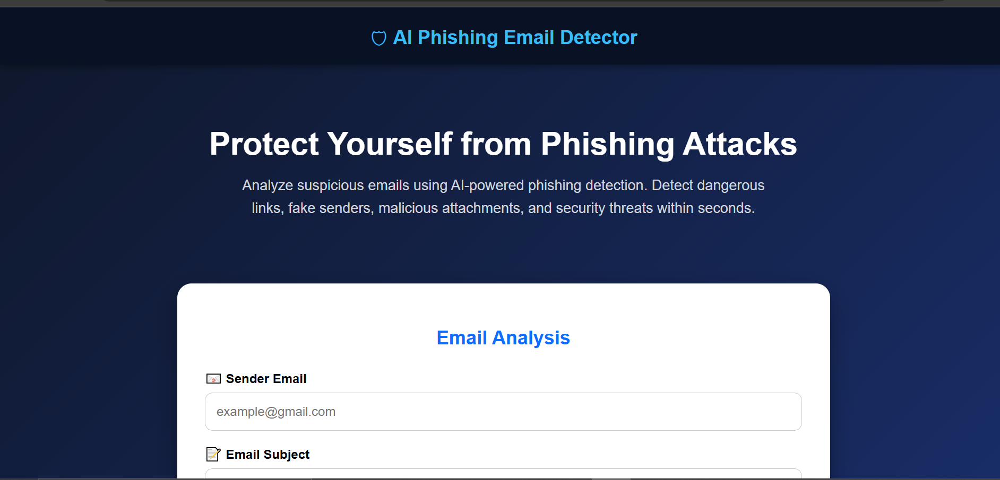
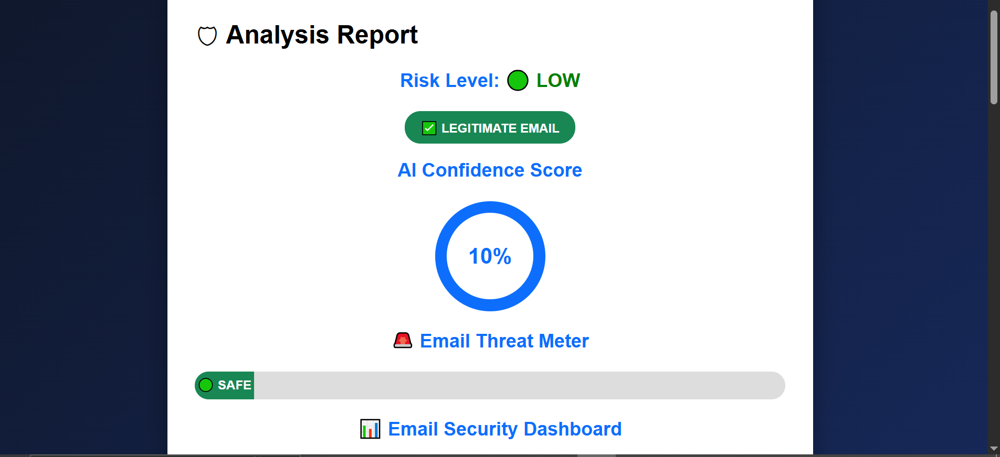
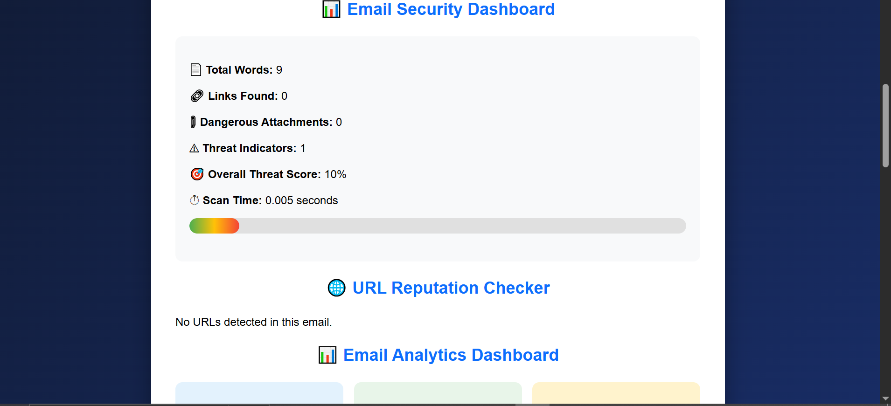
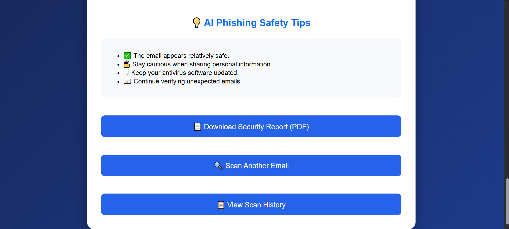
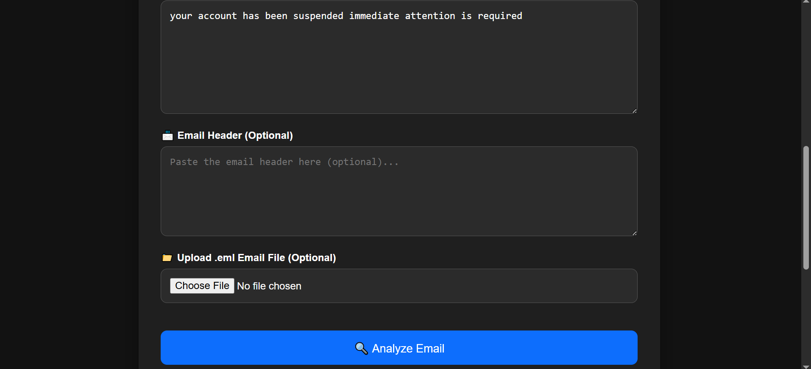
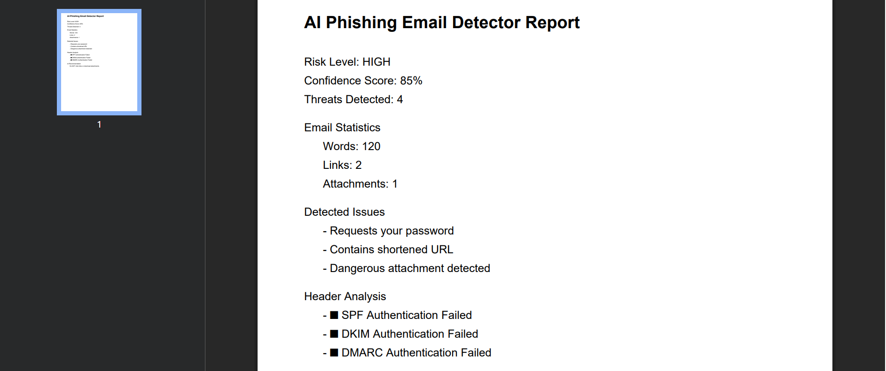

# 🛡 AI Phishing Email Detector

An intelligent web application built using **Python** and **Flask** that analyzes suspicious emails and detects potential phishing attacks using AI-inspired rule-based analysis.

---

## ✨ Features

- 🔍 AI Phishing Detection
- 🎯 AI Confidence Score
- 🎣 Email Classification
- 🚨 Threat Meter
- 📊 Email Analytics Dashboard
- 🌐 URL Reputation Checker
- 📧 Email Header Analysis (SPF, DKIM & DMARC)
- 📄 PDF Security Report
- 🌙 Dark Mode
- ⏳ Loading Animation
- 📋 Scan History
- 📱 Responsive User Interface

---

## 🛠 Technologies Used

- Python
- Flask
- HTML5
- CSS3
- JavaScript
- Jinja2
- ReportLab

---
## 📸 Screenshots

### 🏠 Home Page



---

### 📊 Analysis Report



---

### 📈 Statistics Dashboard


---

### 📋 Scan History


---

### 📊 Analysis Dashboard



---

### 🛡 AI Decision & Recommendations



---

### 🌙 Dark Mode



---

### 📄 PDF Report


---

## 🚀 Installation

### 1. Clone the repository

```bash
git clone https://github.com/YOUR_USERNAME/YOUR_REPOSITORY.git
```

### 2. Navigate into the project

```bash
cd YOUR_REPOSITORY
```

### 3. Install dependencies

```bash
pip install -r requirements.txt
```

### 4. Run the application

```bash
python app.py
```

### 5. Open your browser

```
http://127.0.0.1:5000
```
---

## 📂 Project Structure

```text
AI-Phishing-Email-Detector/
│
├── static/
├── templates/
├── screenshots/
├── app.py
├── pdf_report.py
├── requirements.txt
├── README.md
```
---

## 🔮 Future Improvements

- 🤖 Machine Learning-based phishing detection
- 🌐 VirusTotal API integration
- 🔐 User authentication
- ☁ Cloud deployment
- 📊 Advanced analytics dashboard
- 📧 Email reputation API integration
---

## 👩‍💻 Developer

**Fazeen Nadeem**

Computer Science Student  
University of Lahore

If you found this project helpful, consider giving it a ⭐ on GitHub!